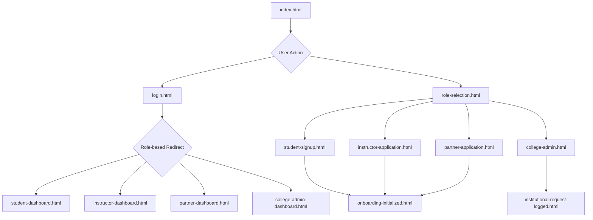

# Martians Academy Frontend Flow

This document outlines the user flow and page structure for the Martians Academy web application.

## User Roles

The platform supports the following user roles:
- **Student**: Enrolls in courses.
- **Instructor**: Creates and manages courses.
- **Partner**: Collaborates with the academy (e.g., companies).
- **College Admin**: Manages institutional accounts.

## Page Flow Diagram

## Flow Description

1.  **Landing Page (`index.html`)**: The main entry point for all users. From here, users can choose to log in or sign up.

2.  **Role Selection (`role-selection.html`)**: New users who want to sign up are directed here to select their role (Student, Instructor, Partner, or College Admin).

3.  **Registration/Application**:
    -   **Students**: Fill out the form on `student-signup.html`.
    -   **Instructors**: Apply via `instructor-application.html`.
    -   **Partners**: Apply via `partner-application.html`.
    -   **College Admins**: Initiate a request from `college-admin.html`.

4.  **Confirmation**:
    -   After a student, instructor, or partner submits their information, they see the `onboarding-initialized.html` page.
    -   After a college admin submits a request, they see the `institutional-request-logged.html` page.

5.  **Login (`login.html`)**: Existing users can log in to their accounts.

6.  **Dashboards**: After logging in, users are redirected to their respective dashboards:
    -   `student-dashboard.html`
    -   `instructor-dashboard.html`
    -   `partner-dashboard.html`
    -   `college-admin-dashboard.html`
